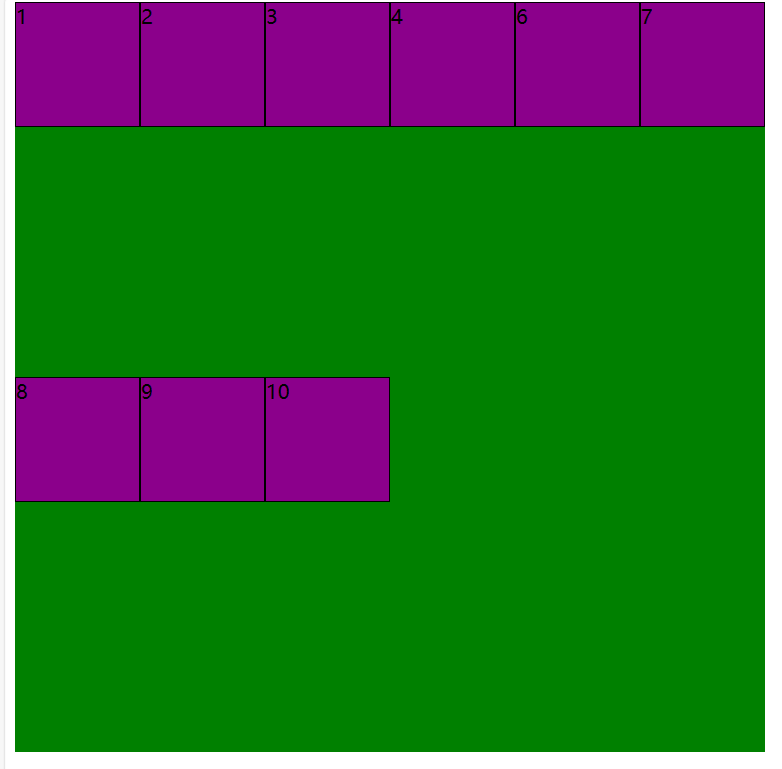
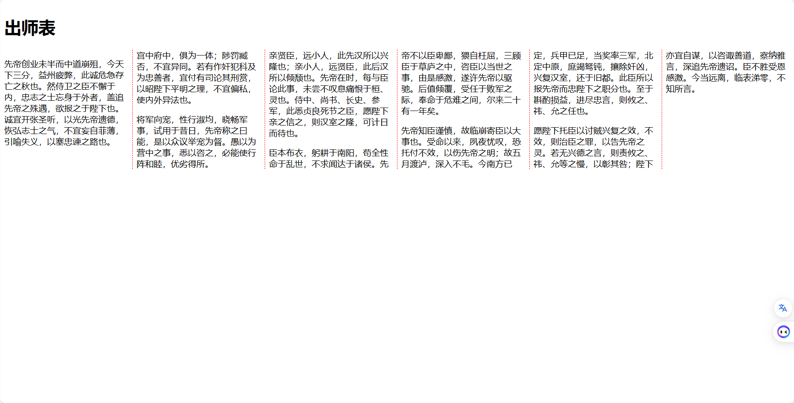

# 布局

### 术语解析

#### 文档流

## 1、弹性布局(flex布局)

### 1.0、描述

可以使用*display: flex*来将元素变为弹性布局（伸缩容器），该容器的直接**子元素**会变为弹性项（flex item），并按行排列。

- 注意：当容器为伸缩容器时，他的所有直接子元素都为弹性项，而不包括后代元素！！！
- 所有的弹性项都为块元素，不管原本是什么元素，直接成为块元素

### 1.1、使用

```html

<body>
<div class="container">
    <div class="inner">1</div>
    <div class="inner">2</div>
    <div class="inner">3</div>
    <div class="inner">4</div>
    <div class="inner">6</div>
    <div class="inner">7</div>
    <div class="inner">8</div>
    <div class="inner">9</div>
    <div class="inner">10</div>
    <div class="inner">11</div>
    <div class="inner">12</div>
    <div class="inner">13</div>
</div>
</body>
<style>
    .container {
        display: flex;
        height: 600px;
        width: 600px;
        background-color: green;
        flex-wrap: wrap-reverse;
    }

    .inner {
        width: 100px;
        height: 100px;
        background-color: darkmagenta;
        border: 1px solid black;
        box-sizing: border-box;
    }
</style>
</html>
```

### 1.2、弹性盒子的轴axes

- 即弹性项的排列方向！水平方向默认从左到右，竖直方向默认从上到下;
- 默认为水平方向
- 使用flex-direction属性

```css
.container {
    display: flex;
    flex-direction: row;
}

.container {
    display: flex;
    flex-direction: row-reverse; /*水平从右向左排列*/
}

.container {
    display: flex;
    flex-direction: column; /*竖直*/
}

.container {
    display: flex;
    flex-direction: column-reverse; /*竖直从下到上排列*/
}
```

#### 1.2.1、主轴

- 当前弹性项的排列方向
-

#### 1.2.2、交叉轴

- 与主轴垂直的排列方向，当主轴确定，则交叉轴随之确定，不需要主动去设置

#### 1.2.3、主轴上的换行方式

- 在主轴上排列的弹性项默认不换行，会持续挤压（缩）自身让容器中的改行容纳更多元素！
- 可以使用flex-wrap主动让其拥有换行能力！

```css
.container {
    display: flex;
    flex-wrap: nowrap; /*默认值，不换行*/
}
```


```css
.container {
    display: flex;
    flex-wrap: wrap; /*普通换行*/
    /*在主轴方向换行，不会影响到侧轴(侧轴上会动态分配空间)*/
}
```



```css
.container {
    display: flex;
    flex-wrap: wrap-reverse; /*从下到上开始换行*/
}
```


#### 1.2.4、主轴的对齐方式

- 对弹性项进行对齐

```css
.container {
    display: flex;
    justify-content: flex-start; /*主轴起始位置对齐*/
}
```


```css
.container {
    display: flex;
    justify-content: center; /*主轴居中对齐*/
}
```

```css
.container {
    display: flex;
    justify-content: space-around; /*弹性项均匀的分布在一行中，每个弹性项的距离时两边项目距离边缘的2倍*/
}
```


```css
.container {
    display: flex;
    justify-content: space-between; /*弹性项均匀的分布在一行中，项目与项目之间的距离时相等的，但前后两边的项目紧贴边缘*/
}
```

```css
.container {
    display: flex;
    justify-content: space-evenly; /*弹性项均匀的分布在一行中*/
}
```


#### 1.2.5、侧轴的对齐方式

##### 1.2.5.1、单行侧轴对齐方式

- 使用align-items进行对齐

```css
.container {
    display: flex;
    align-items: stretch; /*默认值，仅在弹性项没有设置高度时的情况*/
}
```

- 其余值：
    - center
    - flex-star
    - flex-end
    - baseline :基线对齐

##### 1.2.5.2、多行侧轴对齐方式

- 使用align-content进行对齐

```css
.container {
    display: flex;
    align-content: stretch; /*默认值，占满整个轴，需要在弹性盒子未设置高度的前提下*/
}
```

### 1.3、弹性盒子的伸缩属性

```css
.inner {
    flex-grow: 1;
    flex-shrink: 1;
    flex-basis: 200px;
}

```

## 2、网格布局

## 3、多列布局

- 可以理解为分栏

### 3.1、使用

```css
.container {
    column-count: 3; /*直接指定列数*/
}
```

```css
.container {
    column-width: 300px; /*这只每列宽度*/
}
```

```css
.container {
    column-gap: 12px; /*指定每列之间的距离，注意设置为0时也会有一个极限最小值*/
}
```

```css
.container {
    column-rule: 1px solid red; /*指定每列边框的样式 【符合属性】【分解属性：-width -style -color】*/
}
```

```css
.container {
    column-span: all; /*横跨多少列 只有none和all*/
}
```

