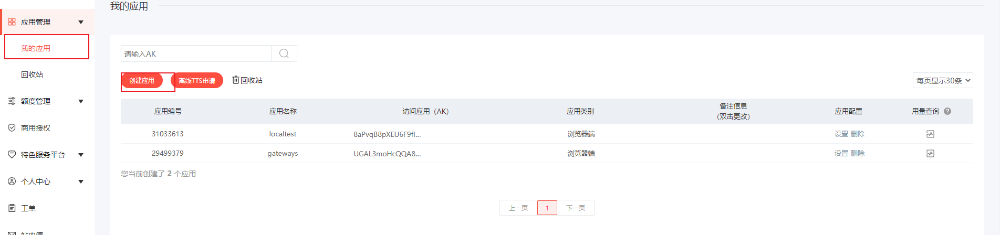
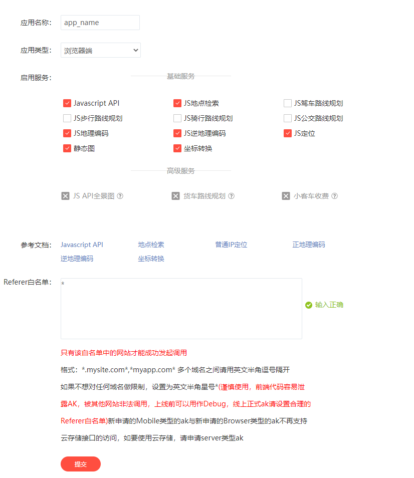

## 步骤
#### 1、开通百度地图平台权限
https://lbsyun.baidu.com/


######  创建应用，即可获取AK




####  2、引入与使用
npm install vue-baidu-map --save

###### 2.1、全局引入/局部引入

在main.js中引入
import BaiduMap from 'vue-baidu-map'

Vue.use( BaiduMap, { ak : '上面生成的ak' } )

###### 2.2、组件使用
更多API：https://dafrok.github.io/vue-baidu-map/#/zh/map/baidu-map


### vue代码

```vue
<template>

  <!--地图组件-->
  <baidu-map :center="center"
             :zoom="zoom"
             :dragging="false"
             :map-click="false"
             @ready="readyMap"
             class="baidu_map">
    <!--
      center:中心呈现
      zoom:缩放倍数
      dragging:是否可拖拽
      mapClick:地图是有点击效果

      @ready:地图组件补充初始化事件，在地图组件初始化时会自动调用该方法
    
    -->

    <!--标记-->
    <bm-marker v-if="infoWindowShow" :position="{lng: longitude, lat: latitude}">
      <bm-label content="" :labelStyle="{color: 'red', fontSize : '24px'}"
                :offset="{width: -35, height: 30}"/>
    </bm-marker>

    <!--信息串口-->
    <bm-info-window :position="{lng: longitude, lat: latitude}" :show="true">
      <p>纬度:{{ this.latitude }}</p>
      <p>经度:{{ this.longitude }}</p>
    </bm-info-window>

  </baidu-map>

</template>

<script>

export default {
  method: {

    readyMap({BMap, map}) {
      this.point = new window.BMap.Point(this.form.longitude, this.form.latitude);
      // 设置中心与缩放
      map.centerAndZoom(this.point, this.zoom);
      this.BMap = BMap
      this.map = map
      this.longitude = this.form.longitude
      this.latitude = this.form.latitude
    },
  }

}
</script>
```